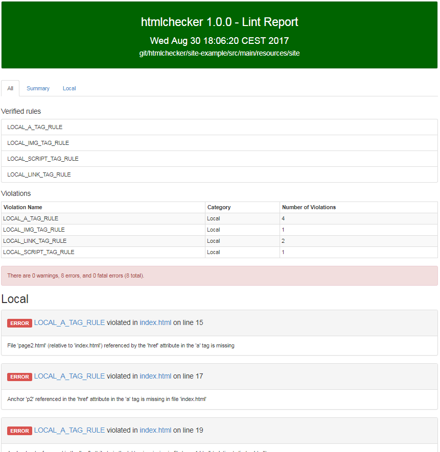

:github-readme: ../../README.adoc

include::{github-readme}[tags=vardef]

:projectpage: https://github.com/{git-repository}
:bintray_repo: https://bintray.com/jmini/maven
:bintraypage: {bintray_repo}/htmlchecker

include::{github-readme}[tags=header]

== URLs

* link:{homepage}[Project home] (this page)
* link:{projectpage}[GitHub project]
* link:{bintraypage}[Binaries on Bintray]
* link:{issues}[Issue tracker]

TIP: Do you want to improve this page? Please git-link:self[edit it on GitHub].

include::{github-readme}[tags=description]

=== Extended description

Htmlchecker scans the `.html` files present in a given directory and verify that certain rules are violated or not.
A report with all warnings and errors can be obtained as HTML or as XML.

==== Checked rules

Those rules ensures that local files referenced as attribute of the html tag are present.
If missing an error is produced.

* git-link:/htmlchecker-core/src/main/resources/doc/rules/LocalATagRule.md[LOCAL_A_TAG_RULE] (`href` attribute in the `<a>` tag)
* git-link:/htmlchecker-core/src/main/resources/doc/rules/LocalImgTagRule.md[LOCAL_IMG_TAG_RULE] (`src` attribute in the `` tag)
* git-link:/htmlchecker-core/src/main/resources/doc/rules/LocalLinkTagRule.md[LOCAL_LINK_TAG_RULE] (`href` attribute in the `<link>` tag)
* git-link:/htmlchecker-core/src/main/resources/doc/rules/LocalScriptTagRule.md[LOCAL_SCRIPT_TAG_RULE] (`src` attribute in the `<script>` tag)

==== Output report

The html report looks like this:

link:example_report_html.png[]

The xml report looks like this:

[source,xml]
----
<?xml version="1.0" encoding="UTF-8"?>
<issues>
    <issue
        name="LOCAL_A_TAG_RULE"
        severity="Error"
        message="File &apos;page2.html&apos; (relative to &apos;index.html&apos;) ......"
        category="Local"
        summary="Local file should be present"
        explanation="All local file referenced by the `href` attribute ......""
        location="....../site-example/src/main/resources/site/index.html"
        lineNumber="15"
    />
    <!-- ..... -->
</issues>
----

=== Download

A compiled version of the project is available on Bintray as maven repository.

You might use maven or gradle to fetch the dependency you need.
You can also directly use the maven plugin as step of your build 

For the command line tool, a zip containing all the requested dependency in a lib folder and a basic statup script can also be downloaded from bintray.

=== Run the tool

==== As maven plugin

In the `plugins` section of your `build` section, you can add something like this:

.Maven plugin usage example
----
include::../../site-example/pom.xml[tags="plugin-usage", indent="0"]
----

Do not forget to define the maven repository `http://dl.bintray.com/jmini/maven/` as possible `pluginRepository` (directly in your pom or in your maven settings).

==== From the command line

After having unzipped the archive you can run `htmlchecker.bat` or `htmlchecker.sh` depending on your operating system.

.Run the command line tool example
----
htmlchecker --html myreport.html site-example/src/main/resources/site/
----

Here is the complete list of options:

.Complete list of options for htmlchecker
----
include::../../htmlchecker-cli/src/test/resources/htmlchecker-help.txt[]
----

include::{github-readme}[tags=contact-section]

include::{github-readme}[tags=license-section]

