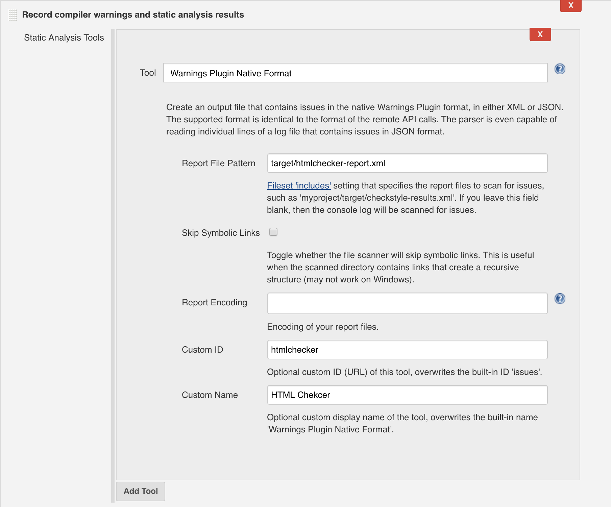

:github-readme: ../../README.adoc

include::{github-readme}[tags=vardef]

:projectpage: https://github.com/{git-repository}

include::{github-readme}[tags=header]

== URLs

* link:{homepage}[Project home] (this page)
* link:{projectpage}[GitHub project]
* link:{issues}[Issue tracker]

TIP: Do you want to improve this page? Please git-link:self[edit it on GitHub].

include::{github-readme}[tags=description]

Htmlchecker scans the `.html` files present in a given directory and verify that certain rules are violated or not.
A report with all warnings and errors can be obtained as HTML or as XML file.

=== Checked rules

Following rules ensures that local files referenced as attribute of some html tags are present.
Missing files correspond to an error.

* git-link:/htmlchecker-core/src/main/resources/doc/rules/LocalATagRule.md[LOCAL_A_TAG_RULE] (`href` attribute in the `<a>` tag)
* git-link:/htmlchecker-core/src/main/resources/doc/rules/LocalImgTagRule.md[LOCAL_IMG_TAG_RULE] (`src` attribute in the `` tag)
* git-link:/htmlchecker-core/src/main/resources/doc/rules/LocalLinkTagRule.md[LOCAL_LINK_TAG_RULE] (`href` attribute in the `<link>` tag)
* git-link:/htmlchecker-core/src/main/resources/doc/rules/LocalScriptTagRule.md[LOCAL_SCRIPT_TAG_RULE] (`src` attribute in the `<script>` tag)

=== Output report

The html report looks like this:

link:example_report_html.png[image:example_report_html.png[HTML Report,300,308]]

See an example for the git-link:site-example[site-example] project: link:example-report.html[example-report.html].

The xml report looks like this:

[source,xml]
----
<?xml version="1.0" encoding="UTF-8"?>
<issues>
    <issue
        name="LOCAL_A_TAG_RULE"
        severity="Error"
        message="File &apos;page2.html&apos; (relative to &apos;index.html&apos;) ......"
        category="Local"
        summary="Local file should be present"
        explanation="All local files referenced by the `href` attribute ......"
        location="....../site-example/src/main/resources/site/index.html"
        lineNumber="15"
    />
    <!-- ..... -->
</issues>
----

See an example for the git-link:site-example[site-example] project: link:example-report.xml[example-report.xml].

== Download

Since version 1.2.0, a compiled version of the project is available on maven central.

You might use maven or gradle to fetch the dependencies you need, depending on your use case.
You can also directly use the maven plugin as step of your build.

For the command line tool, a zip file is also available: 
link:https://repo1.maven.org/maven2/fr/jmini/htmlchecker/htmlchecker-cli/{project-version}/htmlchecker-cli-{project-version}-bin.zip[htmlchecker-cli-{project-version}-bin.zip].
It contains all the requested dependencies in a `lib` subfolder and basic startup scripts.

== Run the tool

=== As maven plugin

In the `plugins` section of your `build` section, you can add something like this:

[source,xml]
.Maven plugin usage example
----
include::../../site-example/pom.xml[tags="plugin-usage", indent="0"]
----

Possible configuration parameters for the maven plugin:

sourceDirectory:: Directory to scan (default value is `${project.basedir}`).
outputType:: Type of report that should be created, possible values:
**** `html` (default)
**** `xml`
outputFile:: Name of the file, where the report will be created (default value is `${project.build.directory}/report.html`).
srcPathPrefix:: Local or remote path to the source directory, if not set (default) a relative path to the local file will be computed. For the `site-example` project in this repository, the remote path to view the files on GitHub is: `https://github.com/jmini/htmlchecker/blob/master/site-example/src/main/resources/site/`.
enableOnlyRules:: Only check for these rules. Ignored if not set (default).
disableRules:: Disable the list of rules. Ignored if not set (default).
enableRules:: Enable the list of rules. Ignored if not set (default).
enableCategories:: Run all rules of certain categories. Ignored if not set (default).
noWarnings:: Only check for errors; ignore warnings. Possible values:
**** `false` (default)
**** `true`
allWarnings:: Check all warnings, including those off by default. Possible values:
**** `false` (default)
**** `true`
waringsAreErrors:: Treat all warnings as errors. Possible values:
**** `false` (default)
**** `true`

=== From the command line

After having unzipped the archive, you can run `htmlchecker.cmd` or `htmlchecker.sh` depending on your operating system.

.Run the command line tool example
----
htmlchecker --html myreport.html site-example/src/main/resources/site/
----

Here is the complete list of options:

.Complete list of options for htmlchecker
----
include::../../htmlchecker-cli/src/test/resources/htmlchecker-help.txt[]
----

== Jenkins integration

With version `1.2.0` and newer a new export format is available: `jenkins-xml`
The generated XML file can be parsed by Jenkins using the link:https://wiki.jenkins.io/x/1YTeCQ[Warnings Next Generation Plugin] (tested with version `5.3.0`).

In your build configuration, in the "Post-build Actions" section, add a "Record compiler warnings and static analysis results" item:

Configure the item with following values:

* Tool: `Warnings Plugin Native Format`
* Report File Pattern: `target/htmlchecker-report.xml` (example value, must match with the output file created when you run the tool)
* Custom ID: `htmlchecker` (optional)
* Custom Name: `HTML Checker` (optional)

Here the same configuration as Jenkins pipeline script:

.Jenkins pipeline syntax
----
recordIssues(tools: [issues(id: 'htmlchecker', name: 'HTML Checker', pattern: 'target/htmlchecker-report.xml')])
----

== Get the sources

The project is hosted on GitHub: link:{projectpage}[{git-repository}]

=== Build

The project is built with maven.

----
mvn install
----

In order to build a release (push a tag to github, upload the binaries to maven central) just run:

----
mvn -Prelease release:prepare
----

And then:

----
mvn -Prelease release:perform
----

include::{github-readme}[tags=contact-section]

include::{github-readme}[tags=license-section]

